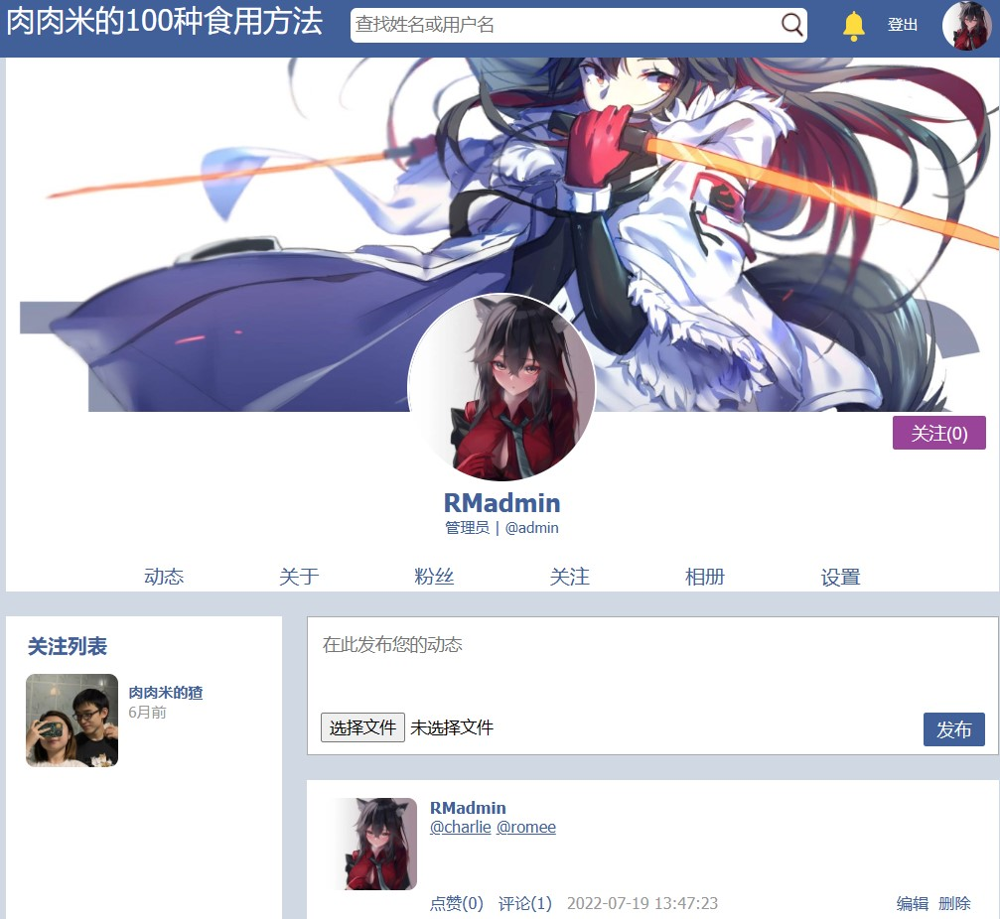

# Simple Social Website

> Self-learning project

This is a simple social website mimicing WeChat. Basic functionalities include:

- User profile management using MySQL database. A user has to first register an account, then log in every time using his/her username and password. User passwords are kept secret using the SHA-1 encryption scheme.
- A decent interface as shown below, with the following basic sections:

    - Username, name, and tag.
    - Profile image and background image. Users can cutomize their profile and background at will by simply clicking on them and selecting images from local.
    - A searchbox. Users can search for other users by typing (part of) their usernames or names.
    - Posts. One can check all their history posts by clicking on the first option to the left (动态). Posts can include text and a single photo. Recent posts of oneself and all his/her subscriptions are also demonstrated on the main page. Users can also edit or delete their own posts and like or comment on all posts. By clicking on the comments, one will jump to a specific post page, with each comment supporting the same functionalities as the original post. Note that by clicking on a post image one can have a larger view of it.
    - About. This is the second option to the left (关于), which includes the basic information of a user.
    - Fans. This is the third option to the left (粉丝), which shows the list of profiles and usernames of users that have subsribed you.
    - Subscriptions. This is the third option to the right (关注), which shows the list of profiles and usernames of users that you have subscribed.
    - Album. This is the second option to the right (相册), which shows the list of all the photos that you have included in your posts.
    - Settings. This is the last option (设置), which allows users to edit their basic information including name, username, email, password, about, etc.

